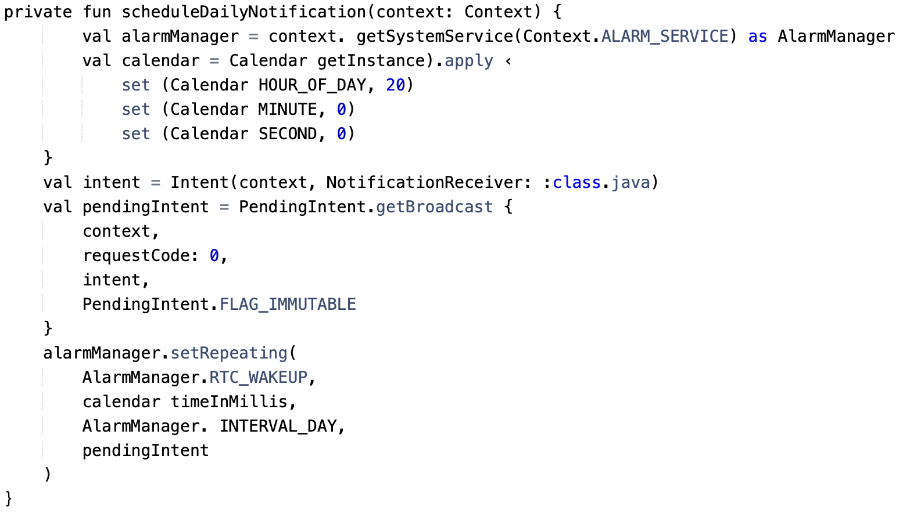
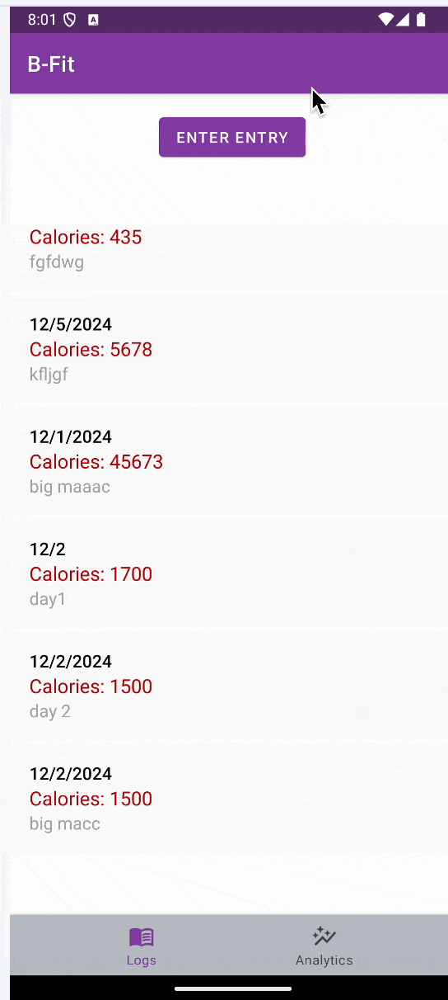

# Android Project 6 - *BitFit - 2*

Submitted by: **Palina Pauliuchenka**

**BitFit-2** is a health metrics app that allows users to track track daily colaroies, send user notifications to enter calories daily, analytics of entries per day.

Time spent: **14** hours spent in total

## Required Features

The following **required** functionality is completed:

- [x] **Use at least 2 Fragments**
- [x] **Create a new dashboard fragment where users can see a summary of their entered data**
- [x] **Use one of the Navigation UI Views (BottomNavigation, Drawer Layout, Top Bar) to move between the fragments**

The following **optional** features are implemented:

- [x] **Add a more advanced UI (e.g: Graphing) for tracking trends in metrics**
- [x] **Implement daily notifications to prompt users to fill in their data**

The following **additional** features are implemented:

- [ ] List anything else that you can get done to improve the app functionality!

## Video Walkthrough

## Notes

Describe any challenges encountered while building the app.

## License

    Copyright 2024 Palina Pauliuchenka

    Licensed under the Apache License, Version 2.0 (the "License");
    you may not use this file except in compliance with the License.
    You may obtain a copy of the License at

        http://www.apache.org/licenses/LICENSE-2.0

    Unless required by applicable law or agreed to in writing, software
    distributed under the License is distributed on an "AS IS" BASIS,
    WITHOUT WARRANTIES OR CONDITIONS OF ANY KIND, either express or implied.
    See the License for the specific language governing permissions and
    limitations under the License.
